# BDH Track B: Implementation Walkthrough

Binary classification of narrative consistency using Baby Dragon Hatchling architecture.

---

## 1. Project Overview

### Task
Given a character backstory and a novel (100k+ words), predict whether the backstory is **consistent** (1) or **contradictory** (0) with the narrative.

### Solution
Leverage BDH's unique **Hebbian ρ-matrix** to track narrative "velocity" - the rate of change in accumulated patterns. Contradictions cause velocity spikes when novel events conflict with primed backstory assumptions.

> [!IMPORTANT]
> **This is an INFERENCE pipeline, not model training.** We use a randomly-initialized BDH to detect pattern anomalies. The "calibration" phase finds optimal threshold - it does NOT update model weights.

---

## 2. Step & Chunk Calculations

### Per-Example Processing

| Book | Words | Bytes (approx) | Tokens | Chunks (2048) |
|------|-------|----------------|--------|---------------|
| In Search of Castaways | 139k | 845KB | ~845,000 | ~412 chunks |
| Count of Monte Cristo | 464k | 2.8MB | ~2,800,000 | ~1,367 chunks |

### Total Steps in Full Pipeline

```
CALIBRATION (80 train examples):
├── Book 1 examples: 49 × 412 chunks = 20,188 chunks
├── Book 2 examples: 31 × 1,367 chunks = 42,377 chunks
└── TOTAL: ~62,565 chunks (forward passes)

INFERENCE (60 test examples):
├── Book 1 examples: 37 × 412 chunks = 15,244 chunks
├── Book 2 examples: 23 × 1,367 chunks = 31,441 chunks
└── TOTAL: ~46,685 chunks

GRAND TOTAL: ~109,250 forward pass operations
```

### Average Steps Per Example
- **Castaways examples**: ~412 steps (chunks)
- **Monte Cristo examples**: ~1,367 steps (chunks)
- **Weighted average**: ~780 steps per train example

---

## 3. Checkpoint Saving

### Current Implementation

```python
# In main.py run_calibration():
if (i + 1) % 10 == 0:  # Every 10 examples
    checkpoint_path = paths["checkpoints"] / f"calibration_partial_{i+1}.json"
    save_checkpoint(calibration, checkpoint_path, config_name)
```

**Checkpoint frequency**: Every 10 examples (~7,800 chunks on average)

### Checkpoint Contents
```json
{
  "timestamp": "2026-01-08T20:00:00",
  "model_config": "small",
  "calibration": {
    "optimal_threshold": 0.0045,
    "train_accuracy": 0.85,
    "consistent_mean": 0.003,
    "contradict_mean": 0.007
  },
  "example_ids": [46, 137, 74, ...],
  "max_velocities": [0.0023, 0.0089, ...],
  "labels": [1, 0, 1, ...]
}
```

> [!NOTE]
> **Checkpoints save calibration progress** (threshold, velocities, labels) - NOT model weights. Model weights are fixed (random initialization) throughout.

---

## 7. Pipeline Architecture: Why Two Files?

| File | Role | What it does |
|------|------|--------------|
| **`main.py`** | **The Engine** | Contains all the actual logic: model loading, calibration loop, inference loop, and plotting. It assumes the environment is ready (libraries installed, data found). |
| **`kaggle_pipeline.py`** | **The Mechanic** | Prepares the environment *before* starting the engine. It installs missing libraries, finds where Kaggle hid the dataset, creates necessary folders, and *then* runs `main.py`. |

**Rule of Thumb:**
- On your local machine: Run `main.py`
- On Kaggle: Run `kaggle_pipeline.py` (it handles the messy setup for you)

---

## 4. Regularization Techniques

### 4.1 Dropout
```python
# In RecurrentBDH
self.drop = nn.Dropout(config.dropout)  # Default: 0.1
xy_sparse = self.drop(xy_sparse)
```

### 4.2 Damping (State Regularization)
```python
ρ_t = 0.99 * ρ_{t-1} + Δρ  # Prevents unbounded growth
```

Damping factor of 0.99 means:
- After 100 chunks: oldest patterns retain (0.99)^100 ≈ 37% influence
- After 500 chunks: (0.99)^500 ≈ 0.7% influence
- Effectively a "sliding window" over ~200-300 chunks

### 4.3 State Detachment (Memory Management)
```python
# Every 10 chunks, prevent gradient accumulation
if chunk_idx % 10 == 0:
    state.detach()  # Breaks computation graph
```

### 4.4 LayerNorm
```python
self.ln = nn.LayerNorm(D, elementwise_affine=False, bias=False)
```
Applied after encoder, attention, decoder, and residual connections.

### 4.5 ReLU Sparsity
```python
x_sparse = F.relu(x_latent)  # Creates sparse activations
```
Only positive activations survive, providing implicit regularization.

---

## 5. Ensembling Strategy

### Planned Approach (Not Yet Implemented)

If velocity-only accuracy < 70%, combine multiple signals:

```python
# Ensemble features
features = {
    "max_velocity": metrics.max_velocity,           # Primary
    "mean_velocity": metrics.mean_velocity,         # Secondary
    "velocity_std": metrics.std_velocity,           # Variance
    "embedding_divergence": compute_divergence(),   # Semantic drift
    "max_surprisal": metrics.max_surprisal,         # Perplexity spike
}

# Weighted combination
score = (
    0.5 * normalized(max_velocity) +
    0.2 * normalized(mean_velocity) +
    0.2 * normalized(embedding_divergence) +
    0.1 * normalized(max_surprisal)
)
```

### Why Ensembling Helps
| Signal | Captures |
|--------|----------|
| Velocity | Pattern conflict rate |
| Divergence | Semantic drift from backstory |
| Surprisal | Token-level prediction difficulty |

---

## 6. Architecture Diagrams

### System Flow

```mermaid
graph TB
    subgraph Input
        CSV["train.csv / test.csv"]
        NOVELS["Novel .txt files"]
    end
    
    subgraph Pipeline["BDH Recurrent Pipeline"]
        TOK["ByteTokenizer"]
        PRIME["prime_with_backstory()"]
        SCAN["scan_novel()"]
        STATE["ρ-Matrix (damping=0.99)"]
    end
    
    subgraph Analysis
        VEL["Velocity Tracker"]
        CAL["Threshold Calibration"]
        PRED["Binary Classifier"]
    end
    
    CSV --> TOK
    NOVELS --> TOK
    TOK --> PRIME
    PRIME --> STATE
    STATE --> SCAN
    SCAN --> VEL
    VEL --> CAL
    CAL --> PRED
```


### Forward Pass Detail

```mermaid
flowchart LR
    EMB[embed] --> LN1[LayerNorm]
    LN1 --> ENC[encoder D→N]
    ENC --> RELU1[ReLU]
    RELU1 --> ATT[Attention+RoPE]
    ATT --> LN2[LayerNorm]
    LN2 --> ENCV[encoder_v]
    ENCV --> RELU2[ReLU]
    RELU1 --> MUL[× gate]
    RELU2 --> MUL
    MUL --> DROP[Dropout 0.1]
    DROP --> DEC[decoder N·nh→D]
    DEC --> LN3[LayerNorm]
    LN3 --> RES[+ residual]
```


---

## 7. Implementation Status

### ✅ Completed Features
| Component | Status | Notes |
|-----------|--------|-------|
| **Core Model** | ✅ Done | Recurrent BDH (4 & 6 layers) |
| **State Tracking** | ✅ Done | ρ-matrix with 0.99 damping |
| **Pipeline Modes** | ✅ Done | Cached (Fast), Streaming (Accurate), Perturbation |
| **Metrics** | ✅ Done | Cosine Similarity (Default) & L2 Norm |
| **Optimization** | ✅ Done | Novel state caching (23x speedup) |
| **Validation** | ✅ Done | 60/20 Stratified Split |
| **Kaggle Support** | ✅ Done | Automated environment setup |

### 🔄 In Progress / Optional
| Feature | Status | Notes |
|---------|--------|-------|
| **Ensembling** | ⏳ Pending | Combine velocity + perplexity if needed |
| **Hyperparam Tuning** | ⏳ Pending | Damping (0.95-0.999), Chunk Size |

---

## 8. Usage Examples

### Standard Execution (Cached Mode)
```bash
# Fast mode (recommended for iteration)
python main.py --small
```

### High-Accuracy Execution
```bash
# Streaming mode (captures temporal dynamics)
python main.py --small --mode streaming
```

### Advanced Analysis
```bash
# Perturbation mode (trajectory divergence)
python main.py --small --perturbation

# Use L2 norm instead of Cosine
python main.py --small --metric l2
```

---

## 9. Theoretical Foundation

### Why Velocity Works
The BDH ρ-matrix accumulates **Hebbian associations**:
- **Consistent backstories**: Patterns align → smooth velocity
- **Contradictory backstories**: Patterns conflict → velocity spikes

This mirrors cognitive dissonance: conflicting information requires more "effort" to process.

### BDH vs Transformer
| Aspect | BDH | Transformer |
|--------|-----|-------------|
| State | Persistent ρ-matrix | None |
| Long context | O(1) per token | O(T²) |
| Sparsity | ReLU enforced | Dense |

---

## 10. Output Files

| File | Description |
|------|-------------|
| `outputs/results.csv` | Final predictions (id, prediction) |
| `outputs/results_detailed.csv` | With velocity metrics |
| `outputs/checkpoints/*.json` | Calibration progress |
| `outputs/plots/*.png` | Velocity distributions |
