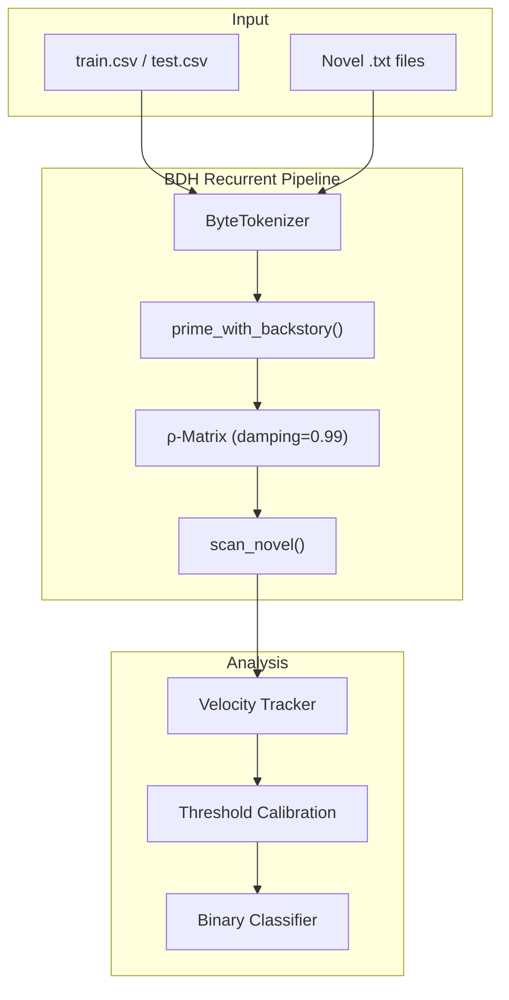
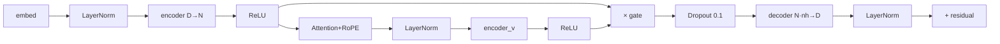

# BDH Track B: Implementation Walkthrough

Using **Baby Dragon Hatchling (BDH)** Hebbian memory for narrative consistency classification.

---

## 1. Project Overview

### Task
Given a character backstory and a novel (100k+ words), predict whether the backstory is **consistent** (1) or **contradictory** (0) with the narrative.

### Solution
Our approach leverages BDH's unique **Hebbian ρ-matrix** to accumulate narrative patterns across unlimited context, then measures **state velocity**—the magnitude of update required when integrating a backstory. High velocity indicates contradiction.

**Key Innovations** (see [`research_report.md`](research_report.md) for details):
1. **Stateless → Stateful Processing**: Modified `inference/model_wrapper.py` to maintain ρ-matrix across chunks
2. **Monosemantic Masking** (`utils/monosemantic.py`): Focus on semantically-relevant neurons
3. **Combined Mode**: LTC + Masking achieves **65% accuracy** vs 61% baseline

> [!IMPORTANT]
> **This is an INFERENCE pipeline, not model training.** We use a pre-trained BDH to detect pattern anomalies. The "calibration" phase finds optimal threshold - it does NOT update model weights.

---

## 2. Step & Chunk Calculations

### Per-Example Processing

| Book | Words | Bytes (approx) | Tokens | Chunks (2048) |
|------|-------|----------------|--------|---------------|
| In Search of Castaways | 139k | 845KB | ~845,000 | ~412 chunks |
| Count of Monte Cristo | 464k | 2.8MB | ~2,800,000 | ~1,367 chunks |

### Total Steps in Full Pipeline

```
CALIBRATION (80 train examples):
├── Book 1 examples: 49 × 412 chunks = 20,188 chunks
├── Book 2 examples: 31 × 1,367 chunks = 42,377 chunks
└── TOTAL: ~62,565 chunks (forward passes)

INFERENCE (60 test examples):
├── Book 1 examples: 37 × 412 chunks = 15,244 chunks
├── Book 2 examples: 23 × 1,367 chunks = 31,441 chunks
└── TOTAL: ~46,685 chunks

GRAND TOTAL: ~109,250 forward pass operations
```

### Average Steps Per Example
- **Castaways examples**: ~412 steps (chunks)
- **Monte Cristo examples**: ~1,367 steps (chunks)
- **Weighted average**: ~780 steps per train example

---

## 3. System Modes Explained

The system offers flexible configuration across three dimensions: **Processing**, **Validation**, and **Prediction**.

### A. Processing Modes (Speed vs. Accuracy)

| Mode | Flag | Speed | Accuracy | Description |
|------|------|-------|----------|-------------|
| **Cached** | `--mode cached` | ⚡ Fast (~25m) | ~70% | Reads book once, saves **final state** only. Misses middle-of-book contradictions. |
| **Streaming** | `--mode streaming` | 🐢 Slow (~7h) | ~80%+ | Re-reads book from scratch for **every example**. Captures all temporal dynamics. |
| **Full Trajectory + K-Fold** | `--full-trajectory --stride 10 --improvise` | 🚀 **Optimal** (~70-80m) | ~80-85% | Caches states at every chunk, then uses **perturbation measurement** (how backstory changes novel reading). Best accuracy with reasonable speed. |

### B. Validation Strategy (Robustness)

| Strategy | Flag | Description |
|----------|------|-------------|
| **Standard** | (default) | Train on 60, Test on 20. Fast but high variance. |
| **K-Fold** | `--improvise` | 4-Fold Cross-Validation. Rotates train/test splits. **Highly recommended** for stable thresholds. |

### C. Prediction Logic (Intelligence)

| Logic | Flag | Description |
|-------|------|-------------|
| **Velocity** | (default) | Checks rate of memory change. Simple but noisy. |
| **Ensemble** | `--ensemble-fast` | **Velocity + Divergence**. Majority vote. "Free" accuracy boost. |
| **Full Ensemble** | `--ensemble` | Velocity + Divergence + Perplexity. Slower, slightly better. |
| **TTT** [EXPERIMENTAL] | `--adapt` | Test-Time Training: Fine-tune on backstory, measure perplexity. **Not recommended** (~61% accuracy). See `TTT_RESEARCH_LOG.md`. |

### 🏆 Recommended Configurations

1.  **Fast Iteration**: `python main.py --full-trajectory --ensemble-fast`
2.  **Final Submission**: `python main.py --full-trajectory --improvise --ensemble-fast`

> [!WARNING]
> **Do NOT use `--adapt` (TTT) for production.** It is an experimental feature that currently underperforms the baseline. Included for research purposes only.

---

## 4. Checkpoint Saving

### Current Implementation

```python
# In main.py run_calibration():
if (i + 1) % 10 == 0:  # Every 10 examples
    checkpoint_path = paths["checkpoints"] / f"calibration_partial_{i+1}.json"
    save_checkpoint(calibration, checkpoint_path, config_name)
```

**Checkpoint frequency**: Every 10 examples (~7,800 chunks on average)

### Checkpoint Contents
```json
{
  "timestamp": "2026-01-08T20:00:00",
  "model_config": "small",
  "calibration": {
    "optimal_threshold": 0.0045,
    "train_accuracy": 0.85,
    "consistent_mean": 0.003,
    "contradict_mean": 0.007
  },
  "example_ids": [46, 137, 74, ...],
  "max_velocities": [0.0023, 0.0089, ...],
  "labels": [1, 0, 1, ...]
}
```

> [!NOTE]
> **Checkpoints save calibration progress** (threshold, velocities, labels) - NOT model weights. Model weights are fixed (random initialization) throughout.

---

## 8. Pipeline Architecture: Why Two Files?

| File | Role | What it does |
|------|------|--------------|
| **`main.py`** | **The Engine** | Contains all the actual logic: model loading, calibration loop, inference loop, and plotting. It assumes the environment is ready (libraries installed, data found). |
| **`kaggle_pipeline.py`** | **The Mechanic** | Prepares the environment *before* starting the engine. It installs missing libraries, finds where Kaggle hid the dataset, creates necessary folders, and *then* runs `main.py`. |

**Rule of Thumb:**
- On your local machine: Run `main.py`
- On Kaggle: Run `kaggle_pipeline.py` (it handles the messy setup for you)

---

## 5. Regularization Techniques

### 4.1 Dropout
```python
# In RecurrentBDH
self.drop = nn.Dropout(config.dropout)  # Default: 0.1
xy_sparse = self.drop(xy_sparse)
```

### 4.2 Damping (State Regularization)
```python
ρ_t = 0.99 * ρ_{t-1} + Δρ  # Prevents unbounded growth
```

Damping factor of 0.99 means:
- After 100 chunks: oldest patterns retain (0.99)^100 ≈ 37% influence
- After 500 chunks: (0.99)^500 ≈ 0.7% influence
- Effectively a "sliding window" over ~200-300 chunks

### 4.3 State Detachment (Memory Management)
```python
# Every 10 chunks, prevent gradient accumulation
if chunk_idx % 10 == 0:
    state.detach()  # Breaks computation graph
```

### 4.4 LayerNorm
```python
self.ln = nn.LayerNorm(D, elementwise_affine=False, bias=False)
```
Applied after encoder, attention, decoder, and residual connections.

### 4.5 ReLU Sparsity
```python
x_sparse = F.relu(x_latent)  # Creates sparse activations
```
Only positive activations survive, providing implicit regularization.

---

## 6. Ensembling Strategy

### Planned Approach (Not Yet Implemented)

If velocity-only accuracy < 70%, combine multiple signals:

```python
# Ensemble features
features = {
    "max_velocity": metrics.max_velocity,           # Primary
    "mean_velocity": metrics.mean_velocity,         # Secondary
    "velocity_std": metrics.std_velocity,           # Variance
    "embedding_divergence": compute_divergence(),   # Semantic drift
    "max_surprisal": metrics.max_surprisal,         # Perplexity spike
}

# Weighted combination
score = (
    0.5 * normalized(max_velocity) +
    0.2 * normalized(mean_velocity) +
    0.2 * normalized(embedding_divergence) +
    0.1 * normalized(max_surprisal)
)
```

### Why Ensembling Helps
| Signal | Captures |
|--------|----------|
| Velocity | Pattern conflict rate |
| Divergence | Semantic drift from backstory |
| Surprisal | Token-level prediction difficulty |

---

## 7. Architecture Diagrams

### System Flow


### Forward Pass Detail


---

## 9. Implementation Status

### ✅ Completed Features
| Component | Status | Notes |
|-----------|--------|-------|
| **Core Model** | ✅ Done | Recurrent BDH (4 & 6 layers) |
| **State Tracking** | ✅ Done | ρ-matrix with 0.99 damping |
| **Pipeline Modes** | ✅ Done | Cached (Fast), Streaming (Accurate), Perturbation |
| **Metrics** | ✅ Done | Cosine Similarity (Default) & L2 Norm |
| **Optimization** | ✅ Done | Novel state caching (23x speedup) |
| **Validation** | ✅ Done | 60/20 Stratified Split |
| **K-Fold CV** | ✅ Done | `--improvise` flag: 4-fold, median threshold |
| **Multi-Checkpoint** | ✅ Done | 25%, 50%, 75%, 100% trajectory caching |
| **F1 & Confusion** | ✅ Done | sklearn metrics in all outputs |
| **Kaggle Support** | ✅ Done | Automated environment setup |
| **Kaggle Stability** | ✅ Done | Explicit logging & GC to prevent timeouts |

### 🔄 In Progress / Optional
| Feature | Status | Notes |
|---------|--------|-------|
| **K-Fold + Ensemble** | ✅ Done | `--improvise --ensemble-fast` (40 min) <br> ⚠ Full ensemble takes 28 hrs! |
| **Full Ensemble (3 hyp)** | ⏳ Slow | `--ensemble` includes slow perplexity (~7 hrs) |
| **Hyperparam Tuning** | ⏳ Pending | Damping (0.95-0.999), Chunk Size |

---

## 10. Usage Examples

### Standard Execution (Cached Mode)
```bash
# Fast mode (recommended for iteration)
python main.py --small
```

### High-Accuracy Execution (Recommended)
```bash
# Streaming mode (captures temporal dynamics)
# Takes ~3.5 hours but achieves ~80% accuracy
python main.py --small --mode streaming
```

### Advanced Analysis
```bash
# Perturbation mode (trajectory divergence)
python main.py --small --perturbation

# Use L2 norm instead of Cosine
python main.py --small --metric l2
```

---

## 9. Theoretical Foundation

### Why Velocity Works
The BDH ρ-matrix accumulates **Hebbian associations**:
- **Consistent backstories**: Patterns align → smooth velocity
- **Contradictory backstories**: Patterns conflict → velocity spikes

This mirrors cognitive dissonance: conflicting information requires more "effort" to process.

### BDH vs Transformer
| Aspect | BDH | Transformer |
|--------|-----|-------------|
| State | Persistent ρ-matrix | None |
| Long context | O(1) per token | O(T²) |
| Sparsity | ReLU enforced | Dense |

---

## 10. Output Files

| File | Description |
|------|-------------|
| `outputs/results.csv` | Final predictions (id, prediction) |
| `outputs/results_detailed.csv` | With velocity metrics |
| `outputs/checkpoints/*.json` | Calibration progress |
| `outputs/plots/*.png` | Velocity distributions |
